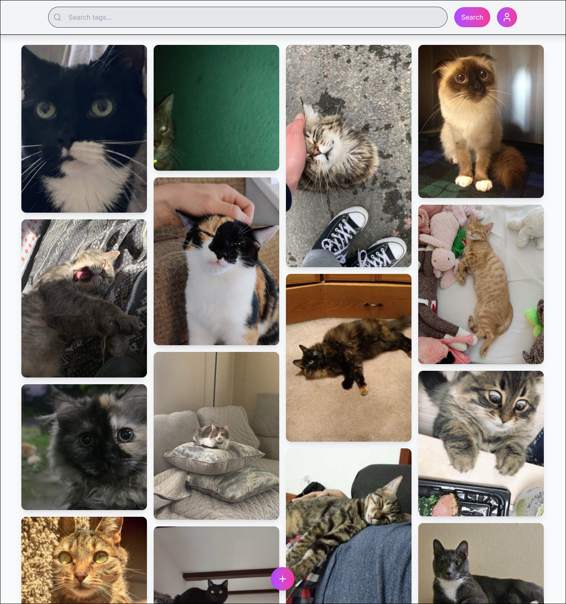
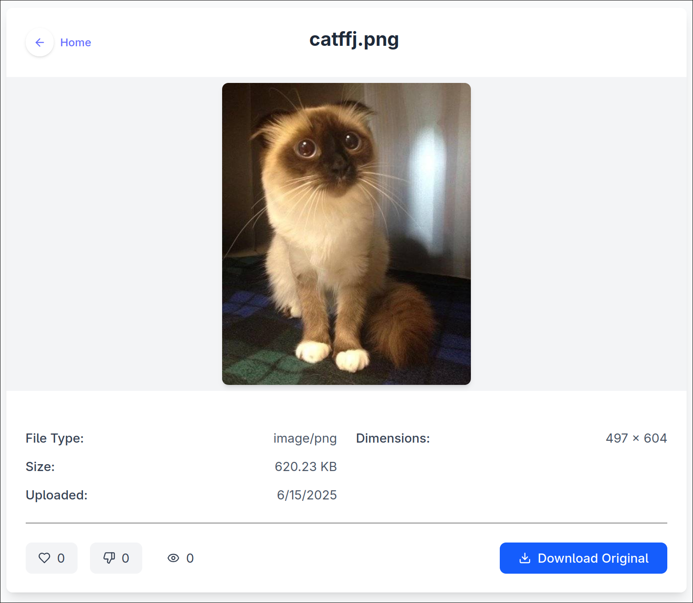
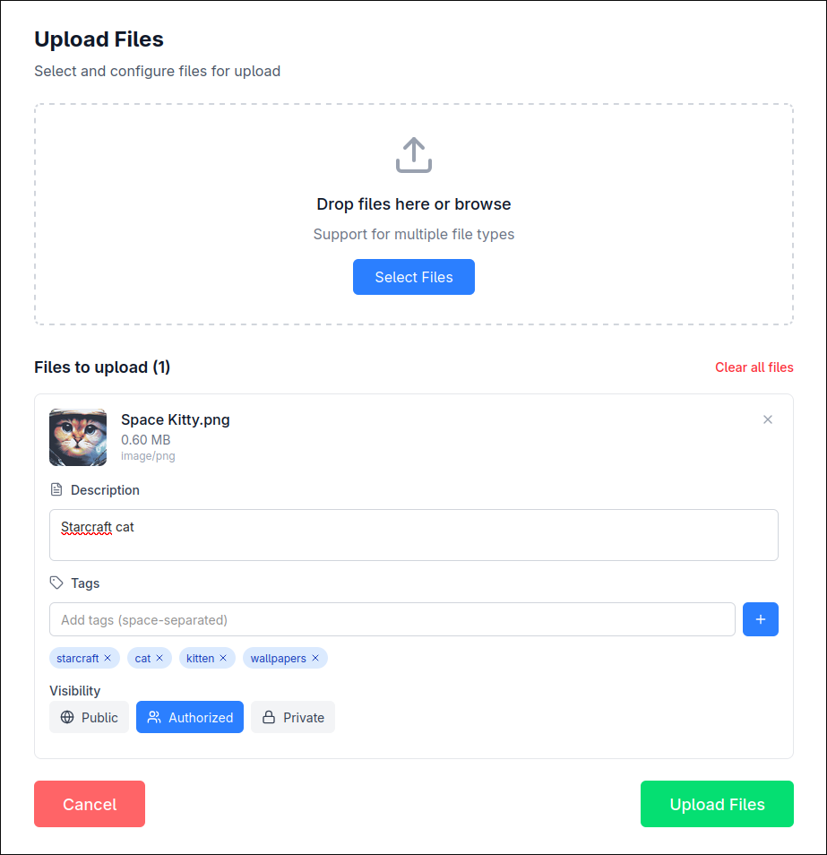
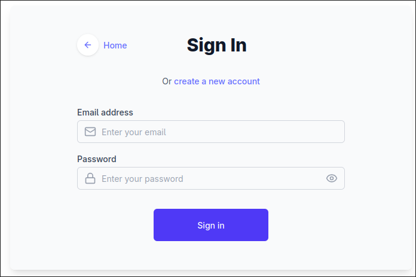

# imgnation

Full-stack image sharing platform. Diploma project, May 2024.

**Stack:** Go · TypeScript (Deno) · MongoDB · MinIO · React 19 · Tailwind v4

- Go REST API with JWT auth, AVIF/WebP transcoding, BLAKE3 content hashing
- MinIO S3 object storage, MongoDB metadata store
- React 19 + Tailwind v4 frontend on Deno

## Screenshots

### Browse


### Image view


### Upload


### Sign up / Sign in



## Running

Build and start MinIO:

```sh
source .env
docker compose -f ./docker-compose.yml build
docker compose -f ./docker-compose.yml up minio
```

On the host, open a shell in the MinIO container:

```sh
docker compose -f ./docker-compose.yml exec minio "/bin/bash"
```

Inside the container, create an access key:

```sh
mc alias set prod http://127.0.0.1:9000 \
  "$MINIO_ROOT_USER" "$MINIO_ROOT_PASSWORD"
mc admin accesskey create prod/
```

Example output:

```
Added `dev` successfully.
Access Key: xxx
Secret Key: xxx
Expiration: NONE
Name:
```

Then either add the keys to the app service in compose as env variables:

```
ACCESS_KEY=xxx
SECRET_KEY=xxx
```

Or create `./imgnation-backend/credentials.json`:

```json
{
  "accessKey": "xxx",
  "secretKey": "xxx"
}
```

Finally, bring up the full stack:

```sh
docker compose -f ./docker-compose.yml up
```
